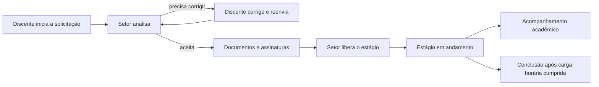

## Em uma frase

O Sistema de Gestão de Estágios (SGE) reúne em um só lugar a solicitação, a formalização, o acompanhamento e a conclusão de estágios, preservando as responsabilidades de cada pessoa envolvida.

## O problema que o SGE resolve

Um estágio envolve informações acadêmicas, parte concedente, jornada, documentos, assinaturas, mudanças durante a vigência e acompanhamento acadêmico. Quando essas etapas ficam separadas entre formulários, e-mails e planilhas, é difícil saber o que falta, qual informação é a atual e quem precisa agir.

O SGE organiza esse processo em etapas conectadas. O discente inicia a solicitação; o Setor de Estágio analisa e formaliza; os participantes acompanham o estágio; e o sistema preserva avisos, decisões e informações relevantes para o processo.

## Quem utiliza o sistema

| Pessoa ou setor | Responsabilidade principal |
| --- | --- |
| Discente | Inicia e acompanha a própria solicitação e o estágio. |
| Setor de Estágio | Analisa, formaliza e acompanha o processo administrativo. |
| Supervisor | Acompanha o discente no local de estágio e preenche a avaliação quando liberada. |
| Orientador | Acompanha academicamente o discente e registra as notas sob sua responsabilidade. |
| Coordenador de curso | Consulta o acompanhamento do curso e emite o atestado de orientação previsto. |
| Administração e Direção de Ensino | Administram ou consultam informações dentro do escopo institucional definido. |

Uma pessoa pode ter mais de uma atuação. No SGE, cada atuação é um **vínculo**: o contexto que define o papel da pessoa, o campus e, quando necessário, o curso em que ela está trabalhando. Para entender os papéis em detalhe, consulte [[SGE - Pessoas e responsabilidades]].

## Como o processo funciona

### Solicitação e análise

O discente preenche a solicitação com as informações necessárias ao estágio e pode salvá-la antes do envio. Depois de enviada, ela é analisada pelo Setor de Estágio. O setor pode aceitar, recusar ou devolver a solicitação com uma explicação do que precisa ser corrigido.

A devolução não cria outro processo: o discente corrige a mesma solicitação e a envia novamente. Isso evita a repetição de dados e deixa claro o que ainda precisa ser resolvido.

### Formalização

Quando a solicitação é aceita, o Setor de Estágio prepara o documento apropriado e acompanha as assinaturas necessárias. A assinatura é uma etapa externa ao sistema e precisa ser conferida antes da liberação do estágio.

### Execução e mudanças

Depois de liberado, o estágio entra em andamento na data planejada. A previsão de término considera a jornada, a carga horária, os dias sem expediente e as pausas registradas.

Durante o estágio, podem existir pausas, substituição autorizada de orientador ou supervisor, aditivos e pedidos de cancelamento. Uma pausa é registrada com período e motivo. Se uma pausa não prevista precisar ser formalizada, o Setor de Estágio providencia o aditivo adequado.

### Acompanhamento acadêmico e conclusão

O supervisor preenche a avaliação quando ela é disponibilizada. O orientador registra as notas de relatório e apresentação. Esses registros acompanham a parte acadêmica do estágio.

O estágio é concluído quando sua carga horária é integralmente cumprida. A previsão de término serve como referência de planejamento e não substitui essa confirmação.

## Avisos e histórico

O sistema avisa as pessoas responsáveis sobre eventos relevantes, como documentos disponíveis, início do estágio, pausas e aproximação do término previsto. A notificação no sistema e o envio de e-mail são acompanhados separadamente, para que uma falha de e-mail não oculte o aviso dentro do SGE.

Também é preservado um histórico de alterações e decisões importantes. Informações sensíveis recebem acesso restrito e não são expostas em avisos gerais.

## Continue a leitura

- [[SGE - Pessoas e responsabilidades|Pessoas e responsabilidades]] para entender cada papel.
- [[SGE - Fluxos principais|Fluxos principais]] para acompanhar as etapas do processo.
- [[SGE - Ciclos de status|Ciclos de status]] para saber o significado das situações do processo.
- [[SGE - Glossário|Glossário]] para consultar os termos usados na documentação.
