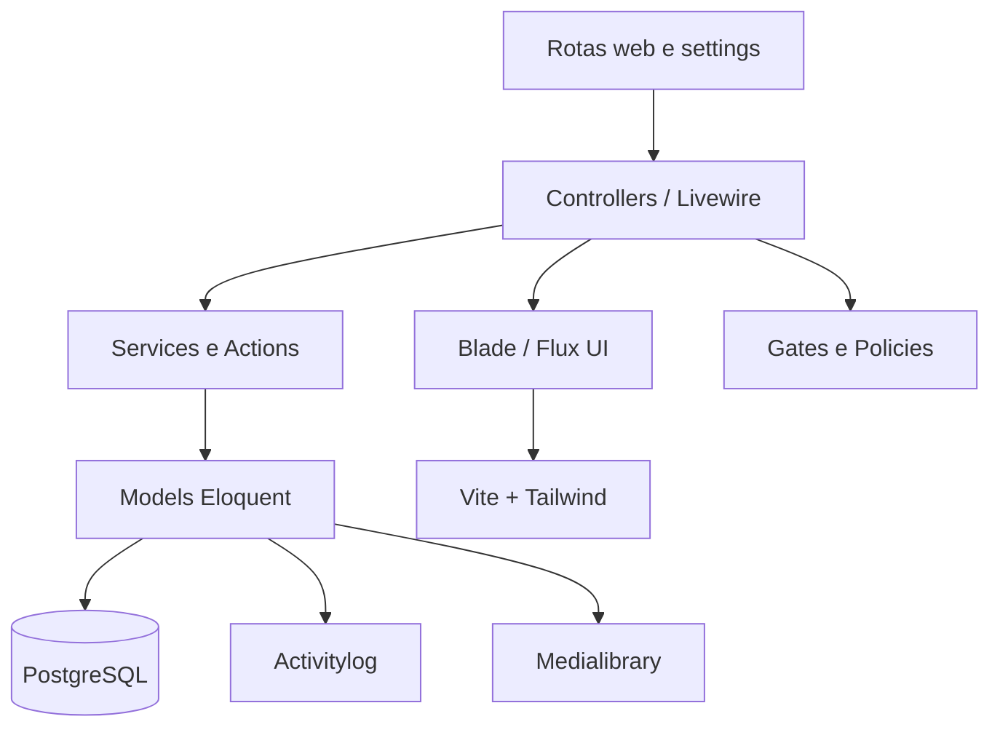

## Leitura em linguagem simples

Esta página mostra como o SGE é montado por dentro. Quem usa o sistema não precisa conhecer estas tecnologias para solicitar, acompanhar ou avaliar um estágio. Em termos simples: há uma tela para as pessoas, regras que conferem cada ação, um banco que guarda as informações e serviços que executam tarefas como calcular datas ou preparar documentos.

Use esta página para saber o que já existe e o que ainda está sendo planejado. Para entender o processo de estágio sem detalhes técnicos, comece por [[SGE - Visão geral]], [[SGE - Pessoas e responsabilidades]] e [[SGE - Fluxos principais]].

## Stack

A implementação atual utiliza:

- Laravel 13.
- PHP 8.3 ou superior.
- Livewire 4 e Flux UI.
- Tailwind CSS e Vite.
- PostgreSQL.
- Laravel Fortify.
- Spatie Activitylog.
- Spatie Medialibrary.
- Laravel Scout e Meilisearch.

## Dependências planejadas do domínio

- `phpoffice/phpword` como dependência direta para inspeção e geração de DOCX;
- `brick/math` como dependência direta, pois valores monetários e escrita por extenso o utilizam em código próprio;
- extensões PHP `zip`, `xml`, `dom`, `mbstring` e `intl` na imagem de produção;

## Organização do código

## Componentes observados

| Área                    | Situação    | Evidência                                                                            |
| ----------------------- | ----------- | ------------------------------------------------------------------------------------ |
| Autenticação            | ✅          | Fortify, páginas Livewire e rotas protegidas                                         |
| Usuários                | ✅          | `app/Models/User.php` e migration `users`                                            |
| Autorização             | Planejado   | Gates/Policies nativos, `AffiliationType` e vínculo ativo; sem tabelas de permissões |
| Auditoria               | ✅          | tabela `activity_log`                                                                |
| Infraestrutura de mídia | ✅          | tabela `media`/Spatie Medialibrary; templates DOCX e versionamento seguem planejados |
| Estágios                | Em evolução | Domínio e fluxos documentados nas páginas funcionais                                 |
| Relatórios              | Planejado   | Devem consumir o domínio e respeitar o escopo do vínculo ativo                       |

## Regras de arquitetura

> [!warning] Limite desta nota
> A arquitetura descrita aqui é a base da aplicação. Para o domínio e os fluxos, consulte [[SGE - Domínio e modelo de dados]] e [[SGE - Fluxos principais]].

- Regras de negócio importantes devem ficar em Services, Actions ou objetos de domínio, evitando controllers grandes.
- Autorização deve ser centralizada em Gates e Policies.
- A autorização é derivada do vínculo ativo, `AffiliationType`, campus/curso e estado do registro; a decisão fica no código e nos testes.
- Alterações persistentes devem ser feitas por migrations.
- Integrações externas devem ser encapsuladas em Services e testadas isoladamente.
- Cálculos determinísticos ficam em Services puros; autorização, transação e efeitos colaterais ficam em Actions/Policies.
- Decisões que alterem o domínio devem manter os modelos e fluxos correspondentes sincronizados.
