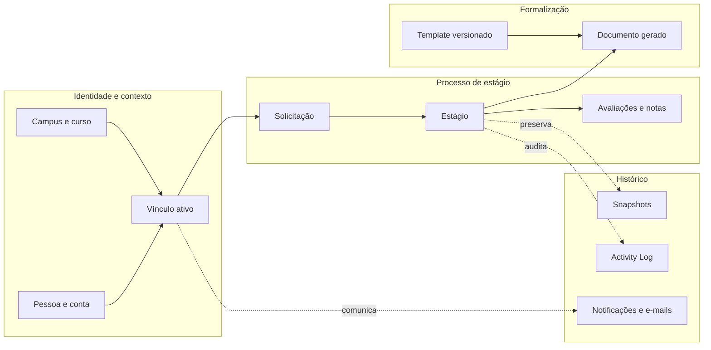

## Antes de olhar os dados

Esta página explica como o sistema organiza as informações para que cada etapa tenha um responsável e um histórico confiável. Não é preciso conhecer banco de dados para acompanhar a ideia: a pessoa inicia uma solicitação, o aceite cria o estágio, documentos e avaliações ficam ligados a ele e mudanças importantes permanecem registradas.

As expressões técnicas aparecem porque esta também é a referência da equipe que implementa o sistema. Sempre que elas forem necessárias, consulte o [[SGE - Glossário|glossário]]. Para entender quem participa de cada etapa, leia [[SGE - Pessoas e responsabilidades]].

## Visão do domínio

Esta página é o ponto de entrada do modelo de dados. Os campos e relacionamentos detalhados ficam nos recortes especializados, evitando repetir contratos em várias notas.

## Encontre a regra certa

| Pergunta | Fonte canônica |
| --- | --- |
| Quais entidades e FKs formam o estágio? | [[SGE - Modelo de dados - Núcleo]] |
| Como a pessoa escolhe um contexto e recebe acesso? | [[SGE - Modelo de dados - Acesso]] |
| Quando usar FK, dado atual, snapshot ou log? | [[SGE - Modelo de dados - Histórico]] |
| Quais estados existem e quem pode mudá-los? | [[SGE - Ciclos de status]] |
| Como as partes se conectam visualmente? | [[SGE - Modelagem de dados]] |
| O que significa cada termo? | [[SGE - Glossário]] |

## Regras que atravessam o modelo

- A pessoa possui uma conta e pode ter vários vínculos institucionais.
- O vínculo ativo define função, campus e curso usados por Gates e Policies.
- Solicitação, estágio, documento e avaliação possuem ciclos independentes.
- Cadastros atuais mantêm relacionamentos por FK; fatos históricos relevantes são congelados em snapshots.
- Alterações relevantes registram autoria e vínculo no Activity Log.
- Templates são versionados; documentos gerados preservam a versão e os dados usados, sem armazenar permanentemente o arquivo final.
- A jornada pactuada, as pausas e os dias sem expediente são registros próprios porque afetam a previsão de término; uma nova vigência de jornada só é criada por aditivo formalizado.

> [!tip] Leitura recomendada
> Para uma visão visual, comece em [[SGE - Modelagem de dados]]. Para implementar uma regra, vá ao recorte correspondente e confirme o fluxo em [[SGE - Fluxos principais]].
