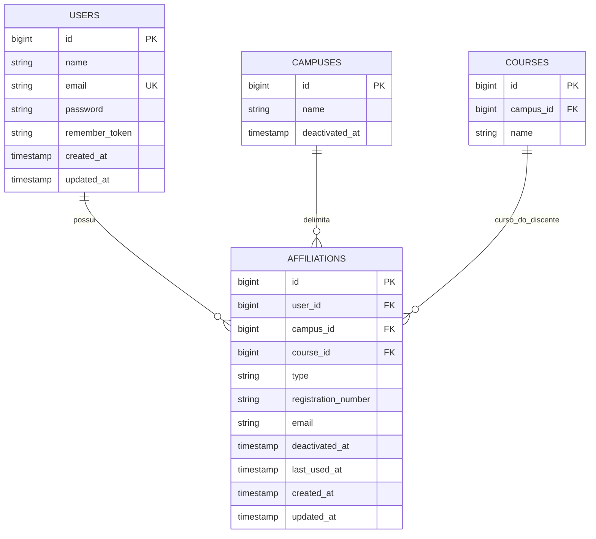

## Antes do diagrama

Em linguagem simples, uma pessoa possui uma conta para entrar no SGE e um ou mais vínculos que dizem em que papel ela está trabalhando. O sistema usa esse papel, o campus, o curso e a relação com o estágio para mostrar apenas as informações necessárias.

O diagrama abaixo usa nomes técnicos de tabelas para atender também a quem desenvolve o sistema. A explicação dos papéis, sem esses termos, está em [[SGE - Pessoas e responsabilidades]].

## Tabelas de acesso



^erd-tabelas-acesso

A função e o escopo pertencem a `affiliations.type`, convertido para o enum `AffiliationType`. Gates e Policies aplicam as regras institucionais sobre esse contexto.

## Contexto ativo e autorização nativa

```mermaid
flowchart LR
    U["`users`
identidade autenticada"] --> A["`affiliations`
função e escopo"]
    A --> S[("vínculo ativo
na sessão")]
    S --> G["Gate before
contexto válido"]
    G --> P["Policies
tipo + campus/curso + estado"]
    P --> D["ações e dados
permitidos"]
```

> [!info] Regra de contexto
> A pessoa autentica uma única conta, escolhe um vínculo ativo e opera somente dentro do campus, curso e tipo desse vínculo. Para atuar em outro contexto, deve existir outro registro em `affiliations` e ele precisa ser selecionado na sessão.

> [!warning] Fonte única de autorização
> `AffiliationType`, vínculo ativo, escopo e estado do registro são os únicos insumos de autorização. Gates e Policies codificam essas regras institucionais de modo determinístico; não há regra de acesso editável em banco.

## Convenção de implementação

- um middleware resolve e valida o vínculo ativo da sessão, incluindo `deactivated_at`;
- `Gate::before` concede somente o acesso global explicitamente definido para `SystemAdministrator`, sem ignorar o vínculo ativo;
- Policies recebem o usuário e resolvem o vínculo ativo por serviço/contexto, verificando `AffiliationType`, campus, curso, posse do registro e estado do fluxo;
- Blade e Livewire usam a API padrão (`@can`, `$user->can()`, `$this->authorize()` e middleware `can:`), nunca comparações espalhadas de string;
- testes cobrem cada decisão da matriz com vínculo correto, tipo errado, campus errado, vínculo desativado e estado inválido.
