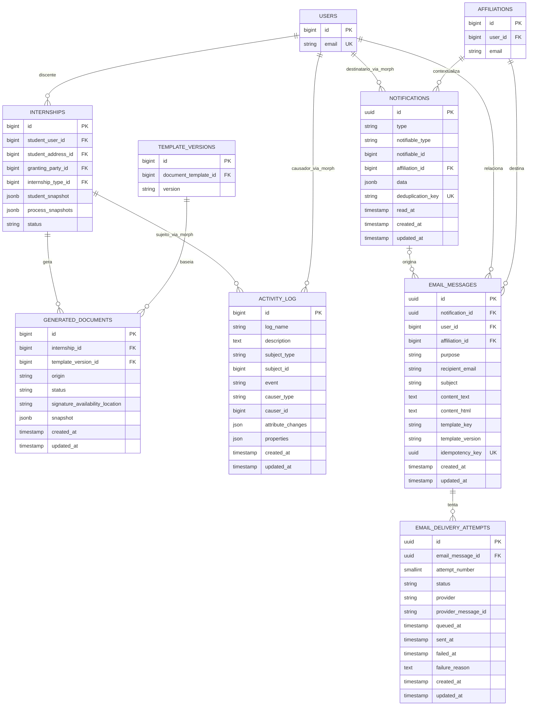

## Histórico, notificações e entregas

^erd-historico-notificacoes-entregas

## Regra de persistência

- A FK aponta para a entidade atual e permite filtros, estatísticas, escopo e rastreabilidade.
- O snapshot `jsonb` registra os valores usados no processo; a alteração do cadastro atual não o reescreve.
- Cada linha de `supervisor_evaluations` representa um formulário por estágio e supervisor. O registro só é editado em `Draft` ou `Returned`; valores anteriores e transições ficam no `activity_log`, sem expor esse log ao supervisor.
- A geração de documento cria seu próprio snapshot, independente do snapshot do estágio; o arquivo final gerado não é armazenado pelo SGE.
- O e-mail operacional preserva um snapshot próprio do destinatário, assunto e conteúdo em `email_messages`; tentativas e reenvios ficam em `email_delivery_attempts`.
- Segredos de autenticação não são snapshots: links e tokens de recuperação nunca são guardados no conteúdo do e-mail. O SGE não terá código ou tabela de verificação de e-mail.

> [!warning] Não confundir
> `addresses` é reutilizável para o endereço atual. O endereço que aparece em um estágio ou documento deve ser lido do snapshot histórico correspondente.
