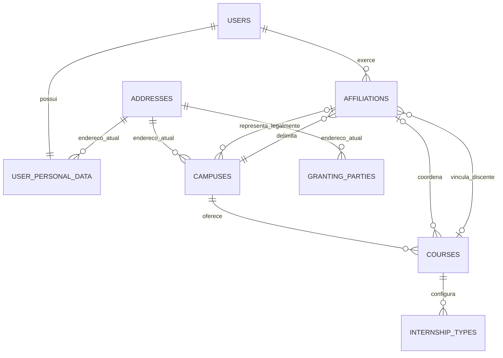
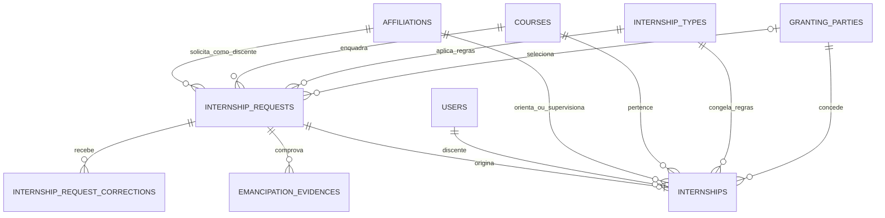
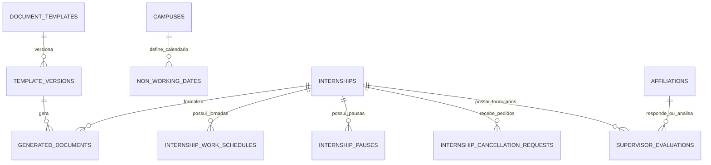

> [!info] Nível deste diagrama
> Este é o modelo relacional conceitual publicado. Ele mostra responsabilidades e cardinalidades; os contratos de campos, índices e nulabilidade ficam em uma única fonte técnica, evitando duplicação no diagrama.

## Identidade, campus e cadastros

| Entidade | Responsabilidade |
| --- | --- |
| `users` | identidade autenticada e credenciais |
| `user_personal_data` | CPF e dados pessoais atuais |
| `affiliations` | função institucional, campus, curso e e-mail contextual |
| `campuses` e `courses` | escopo acadêmico e administrativo |
| `internship_types` | regras de carga, notas e exceções aplicáveis ao curso |
| `granting_parties` | cadastro atual da concedente |

Uma pessoa possui uma conta e quantos vínculos forem necessários. O vínculo ativo, e não a conta isolada, define o contexto usado por Gates e Policies.

## Da solicitação ao estágio

- Existe uma solicitação por processo iniciado pelo discente; devoluções editam o mesmo registro.
- Evidências de emancipação são registros privados, analisados manualmente pelo Setor.
- O estágio nasce apenas após o aceite da solicitação e preserva FKs e snapshots dos dados aprovados.
- Correções posteriores atualizam somente os campos autorizados e não apagam documentos ou estados anteriores.

## Execução, formalização e conclusão

| Conjunto | Regra central |
| --- | --- |
| jornadas, pausas e calendário | determinam a previsão reproduzível de término |
| templates e versões | preservam o modelo usado em cada geração |
| documentos | mantêm origem, versão, estado e snapshot; o arquivo final é temporário |
| avaliação do supervisor | reutiliza o mesmo formulário em `Draft` ou `Returned` |
| notas | supervisor é calculada; relatório e apresentação são lançadas pelo orientador |
| cancelamento | exige pedido e decisão do Setor, preservando o histórico |

## Regras de integridade

- Dados atuais relacionam-se por FK; valores usados em um processo histórico são congelados em snapshots.
- A jornada é pactuada na abertura; outra vigência só pode nascer de aditivo com assinaturas conferidas e não reescreve dias já cumpridos.
- Templates usados não são alterados; uma mudança cria nova versão.
- `Submitted` e `Approved` bloqueiam a avaliação; `Returned` reabre o mesmo registro.
- O Activity Log registra alterações relevantes, mas não substitui tabelas de domínio.

## Leituras relacionadas

- [[SGE - Modelo de dados - Acesso|Conta, vínculos e autorização]].
- [[SGE - Modelo de dados - Histórico|Snapshots, logs e mensagens]].
- [[SGE - Ciclos de status|Estados e transições]].
- [[SGE - Modelagem de dados.canvas|Mapa visual do modelo]].
