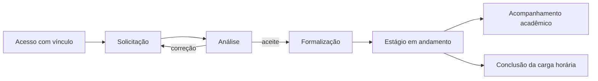

Esta página apresenta a jornada do estágio de ponta a ponta. Para saber quem atua em cada etapa, consulte [[SGE - Pessoas e responsabilidades]]. Para o significado de cada situação exibida pelo sistema, consulte [[SGE - Ciclos de status]].

## Visão da jornada

O [[SGE - Fluxograma do estágio.canvas|fluxograma do estágio]] oferece uma visão visual detalhada da solicitação até a liberação. Ele representa essa parte da jornada; esta página complementa o restante do processo.

## 1. Acesso e vínculo

Cada pessoa acessa o SGE com a própria conta e escolhe a atuação com que quer trabalhar. Essa atuação é o vínculo. Ela define as informações que a pessoa pode consultar e as ações que pode executar no campus ou curso correspondente.

Uma pessoa que possui mais de um vínculo pode trocar de contexto quando necessário. O sistema não mistura as permissões dessas atuações.

## 2. Solicitação

O discente inicia a própria solicitação, preenche os dados necessários e pode salvar o preenchimento antes do envio. Depois de enviar, acompanha a situação do processo e responde às correções pedidas pelo Setor de Estágio.

Se a solicitação precisar de ajuste, o Setor informa o que deve ser corrigido. O discente trabalha na mesma solicitação e a reenvia para nova análise. Antes da formalização, também pode desistir do pedido.

## 3. Análise e formalização

O Setor de Estágio confere a solicitação. Pode aceitá-la, recusá-la ou devolvê-la com pendências. O aceite cria a etapa de formalização.

Na formalização, o Setor prepara o documento apropriado, informa onde ele estará disponível para assinatura e avisa os interessados selecionados. A assinatura acontece externamente e é conferida pelo Setor de Estágio. Somente depois dessa conferência o estágio é liberado.

Se uma informação importante precisar mudar antes da liberação, a correção é registrada no processo e o documento necessário pode ser emitido novamente. Um documento já assinado é preservado como histórico.

## 4. Estágio em andamento

O estágio inicia na data planejada depois de sua liberação. A previsão de término é calculada a partir da carga horária, da jornada, do calendário aplicável e das pausas registradas.

O processo permite:

- registrar uma pausa, com período e motivo;
- substituir orientador ou supervisor quando autorizado;
- formalizar alterações por aditivo; e
- solicitar o cancelamento do estágio.

Uma pausa suspende o cômputo da carga horária e atualiza a previsão de término, mas não altera a jornada. Quando uma pausa não prevista exigir formalização, o Setor de Estágio providencia o aditivo adequado.

O discente pode solicitar cancelamento, sempre informando o motivo. O Setor de Estágio analisa o pedido e trata seus efeitos sobre documentos e acompanhamentos pendentes.

## 5. Avisos automáticos

Algumas situações são atualizadas pela passagem do tempo: o SGE inicia o estágio já liberado na data planejada, registra o início de uma pausa válida e retoma o estágio quando ela termina.

O sistema também avisa o discente sobre o início do estágio, pausas e a aproximação do término previsto. Esses avisos não substituem a análise humana: o sistema não confirma assinaturas, não decide cancelamentos e não conclui o estágio apenas pela chegada de uma data.

## 6. Acompanhamento acadêmico e conclusão

No momento adequado, o supervisor recebe a avaliação do discente. Ele pode preenchê-la aos poucos, enviá-la e corrigi-la se o Setor de Estágio a devolver. O orientador registra as notas acadêmicas sob sua responsabilidade.

O estágio é concluído quando a carga horária integral é cumprida. A avaliação e as notas são registros acadêmicos que acompanham o processo, mas não bloqueiam essa conclusão.

## Continue a leitura

- [[SGE - Pessoas e responsabilidades|Pessoas e responsabilidades]] para conhecer os papéis.
- [[SGE - Ciclos de status|Ciclos de status]] para entender as situações do processo.
- [[SGE - Glossário|Glossário]] para consultar termos do SGE.
