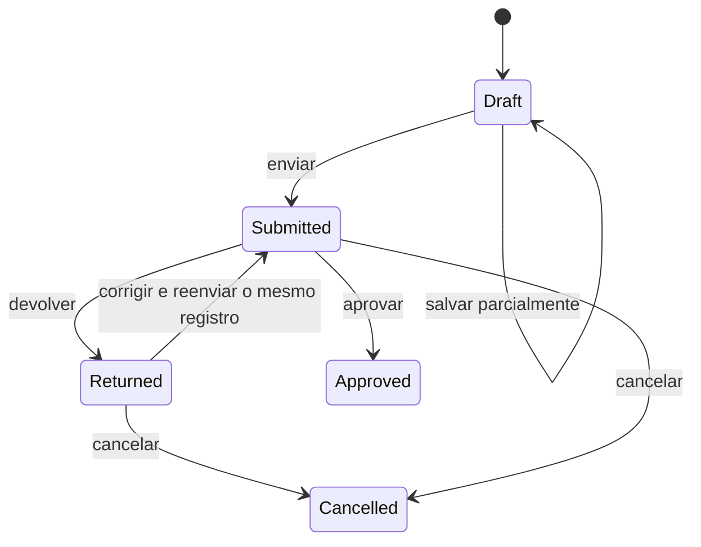

> [!info] Decisão
> O enum será criado porque a avaliação possui rascunho, envio imutável e análise pelo Setor de Estágio. O status controla o ciclo da resposta; sua validade para nota depende da carga horária. A conclusão do estágio segue o ciclo próprio e ocorre quando a carga horária integral é confirmada.

## Contrato proposto

| Case        | Valor persistido | Uso                                                                |
| ----------- | ---------------- | ------------------------------------------------------------------ |
| `Draft`     | `draft`          | Resposta editável, salva pelo supervisor e ainda não enviada.      |
| `Submitted` | `submitted`      | Resposta enviada, congelada e aguardando análise.                  |
| `Returned`  | `returned`       | Envio devolvido com motivo; o mesmo formulário volta a ser editável. |
| `Approved`  | `approved`       | Envio aceito pelo Setor de Estágio; exige carga horária cumprida.  |
| `Cancelled` | `cancelled`      | Registro preservado, encerrado sem aprovação e sem exclusão física. |

## Transições

- Somente o supervisor vinculado ao estágio pode preencher e salvar o `Draft` ou o `Returned`.
- `Draft` aceita preenchimento parcial. Nos demais estados, todos os campos obrigatórios para o ramo condicional escolhido devem estar válidos; ramos não selecionados e pareceres opcionais permanecem nulos.
- Depois da transição para `Submitted`, a resposta fica bloqueada. `Returned` reabre a mesma linha, permitindo ao supervisor editar todos os campos e reenviá-la.
- A análise pertence ao vínculo `AffiliationType::InternshipOffice`. O vínculo `Coordinator` continua representando o coordenador de curso e não concede essa ação automaticamente.
- O Setor de Estágio aprova ou devolve, mas não altera as respostas fornecidas pelo supervisor. O supervisor pode cancelar um envio `Submitted` ou `Returned`; o cancelamento exige motivo.
- Não há exclusão física. Ações, valores anteriores/novos e transições são preservados no `activity_log`, que não é exibido ao supervisor.

## Avaliação vigente

O envio mais recente não substitui imediatamente uma avaliação já vigente. A avaliação considerada para a nota é a resposta `Approved` mais recente, ordenada por `submitted_at` e `id`. O Setor só pode aprovar quando a confirmação de carga horária estiver atendida.

- Um novo `Submitted` permanece apenas como candidato enquanto aguarda análise.
- Um `Returned` nunca é usado no cálculo.
- A avaliação vigente deverá ser referenciada por `internships.current_supervisor_evaluation_id` ou mecanismo equivalente com garantia de unicidade.
- A aprovação da avaliação, isoladamente, não conclui o estágio; a conclusão ocorre quando a carga horária integral é confirmada. Documentos e notas permanecem como registros próprios do processo.

## Liberação e notificação

A liberação para preenchimento pertence ao estágio, não ao enum da resposta. O sistema deverá registrar `evaluation_released_at`, notificar o supervisor vinculado e só então permitir a criação ou edição do rascunho.

## Checklist de decisão e implementação

- [x] Confirmar que a avaliação terá rascunho, envio e devolução no mesmo registro.
- [x] Confirmar que o supervisor responde e o Setor de Estágio aprova ou devolve.
- [x] Confirmar que a avaliação vigente será a aprovada mais recente, com aprovação condicionada à carga horária cumprida.
- [x] Definir pesos e valores dos conceitos no snapshot do tipo de estágio.
- [x] Mapear critérios, escala e regras condicionais do formulário fixo de avaliação.
- [ ] Criar enum, migration e campos de liberação/avaliação vigente.
- [ ] Adicionar cast, transições e testes de histórico.
- [x] Atualizar [[SGE - Migration - 18 - Evaluations|migration de avaliação]] e [[SGE - Fase 09 - Avaliação e conclusão|fase de avaliação]].

## Relacionamentos

- [[SGE - Backlog e decisões#D-009 — Ciclo e validade da avaliação do supervisor|Decisão D-009]]
- [[SGE - Fluxos principais#6 Acompanhamento acadêmico e conclusão|Fluxo de avaliação]]
- [[SGE - Guia de desenvolvimento]]
