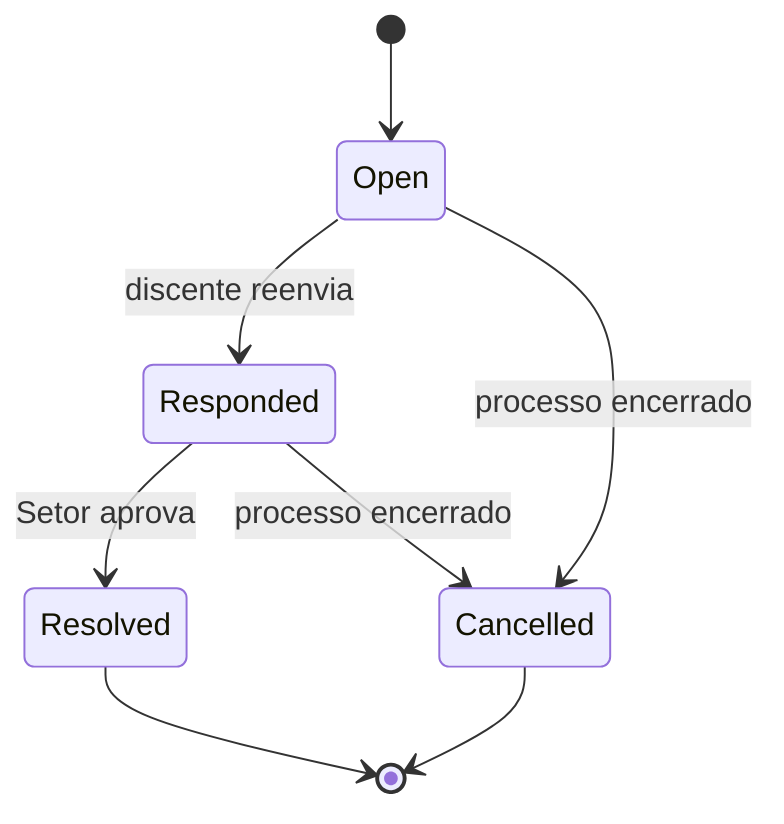

> [!todo] Estado
> Planejado. Este enum controla a pendência; ele não substitui o status da solicitação nem o [[SGE - Migration - Base 04 - Activity log|`activity_log`]].

## Contrato

| Case | Valor persistido | Rótulo | Efeito |
| --- | --- | --- | --- |
| `Open` | `open` | Aberta | O discente pode editar exclusivamente as seções indicadas. |
| `Responded` | `responded` | Respondida | O discente reenviou; a solicitação voltou à fila de análise. |
| `Resolved` | `resolved` | Resolvida | O Setor aprovou os dados corrigidos e aplicou o resultado ao estágio quando houver. |
| `Cancelled` | `cancelled` | Cancelada | A pendência perdeu objeto, por desistência ou encerramento do processo. |

## Transições

Somente uma correção em `Open` pode existir por solicitação. Uma correção `Responded` permanece no histórico enquanto o Setor analisa; se ele devolver outra pendência, encerra a anterior conforme a decisão e abre uma nova, com sua própria mensagem e seções afetadas.

## Checklist de implementação

- [ ] Criar enum string, rótulos, `options()` e `values()`.
- [ ] Adicionar cast em `InternshipRequestCorrection`.
- [ ] Usar o enum na [[SGE - Migration - 20 - Internship request corrections|migration de internship_request_corrections]].
- [ ] Garantir por constraint/validação que só exista uma pendência aberta por solicitação.
- [ ] Testar devolução, reenvio, nova devolução, aprovação e desistência.
