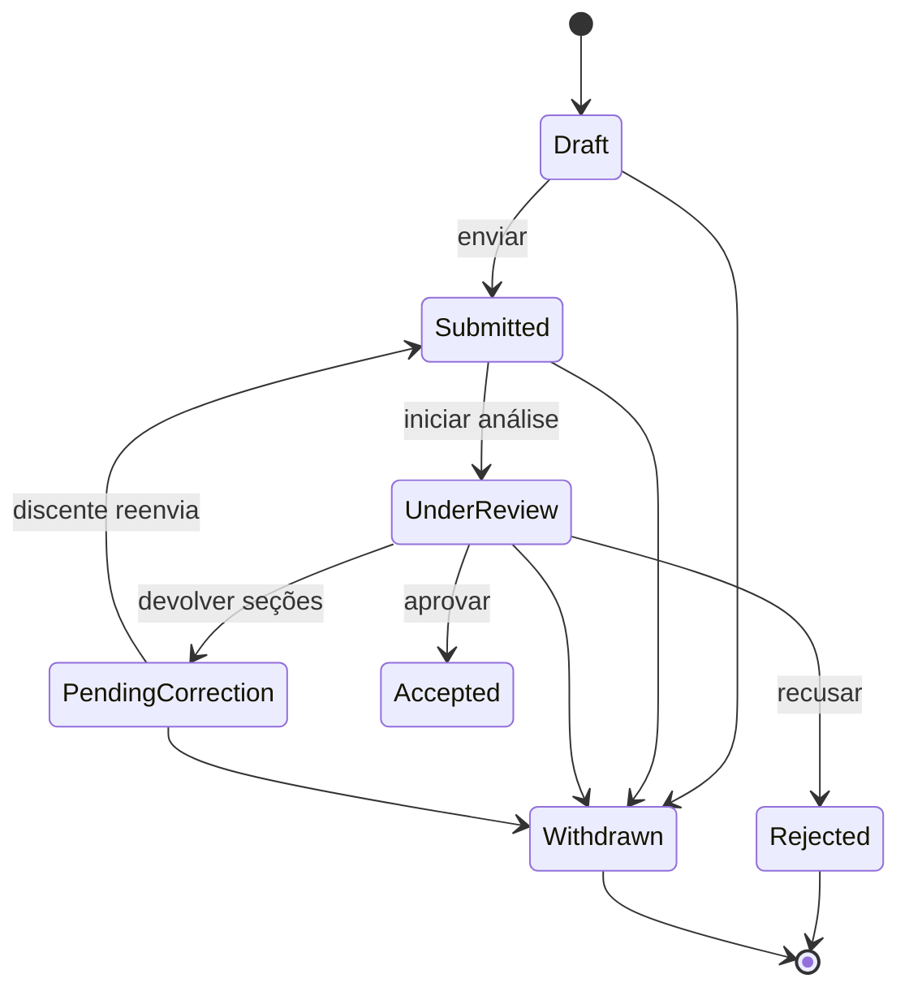

> [!todo] Estado
> Planejado. Separa o formulário da formalização e execução registradas em [[SGE - Enum - InternshipStatus|`InternshipStatus`]].

## Contrato

| Case | Valor persistido | Rótulo | Efeito |
| --- | --- | --- | --- |
| `Draft` | `draft` | Rascunho | O discente pode preencher e salvar, sem enviar ao Setor. |
| `Submitted` | `submitted` | Enviada | Envio novo ou correção respondida; aguarda o início da análise formal. |
| `UnderReview` | `under_review` | Em análise | O Setor de Estágio está analisando. |
| `PendingCorrection` | `pending_correction` | Com pendência | Há uma [[SGE - Enum - InternshipRequestCorrectionStatus|correção aberta]] com seções liberadas ao discente. |
| `Accepted` | `accepted` | Aceita | O Setor aprovou os dados atuais. Cria o estágio na primeira vez ou atualiza o estágio já vinculado. |
| `Rejected` | `rejected` | Recusada | O processo foi encerrado pelo Setor antes da formalização. |
| `Withdrawn` | `withdrawn` | Desistida | O discente desistiu antes de existir um estágio. |

## Transições

`Accepted` não é final: uma correção posterior à criação do estágio pode levar a solicitação novamente a `PendingCorrection`, depois a `Submitted` e `UnderReview`. A nova aprovação mantém a mesma solicitação e o mesmo `internship_id`.

## Integração com o estágio já criado

Quando `internship_id` já existir, a solicitação continua sendo a fonte editável somente durante uma correção aberta. O estágio mantém seus dados e snapshots aprovados enquanto o discente corrige o formulário. Ao aprovar o reenvio, o Setor aplica ao estágio apenas as seções autorizadas, recalcula os valores derivados — como data prevista de término —, preserva o histórico e reemite os documentos necessários. Não são criadas outra solicitação nem uma versão completa de resposta; o [[SGE - Migration - Base 04 - Activity log|`activity_log`]] registra as alterações.

Depois de `released_at`, mudanças contratuais devem seguir o fluxo próprio de alteração/aditivo, e não reabrir o formulário de abertura.

## Preenchimento incremental e retenção

`Draft` é salvo incrementalmente pelo Livewire e pode manter campos nulos, exceto os identificadores técnicos do proprietário e o próprio status. Ao enviar ou seguir para análise, todos os campos obrigatórios e condicionais do caso escolhido devem estar válidos; campos de opções não selecionadas permanecem nulos. Em `PendingCorrection`, somente as seções autorizadas ficam editáveis, mas continuam obedecendo às mesmas validações.

O discente consulta uma lista das próprias solicitações, com status e última atualização, sem acesso ao `activity_log`. Não há exclusão física: `Withdrawn` preserva a solicitação desistida e sua auditoria. Para permitir a retenção de um rascunho abandonado, o cancelamento pode preservar campos incompletos que existiam no momento da desistência.

## Checklist de implementação

- [ ] Criar enum string, rótulos, `options()` e `values()`.
- [ ] Adicionar cast em `InternshipRequest`.
- [ ] Usar o enum na [[SGE - Migration - 19 - Internship requests|migration de internship_requests]].
- [ ] Implementar guardas de transição e Policies do discente e do Setor.
- [ ] Testar primeiro envio, pendência, reenvio, aceite inicial, reaprovação e desistência.

## Referências

- [[SGE - Migration - 19 - Internship requests]]
- [[SGE - Migration - 20 - Internship request corrections]]
- [[SGE - Fluxos principais#2 Solicitação]]
