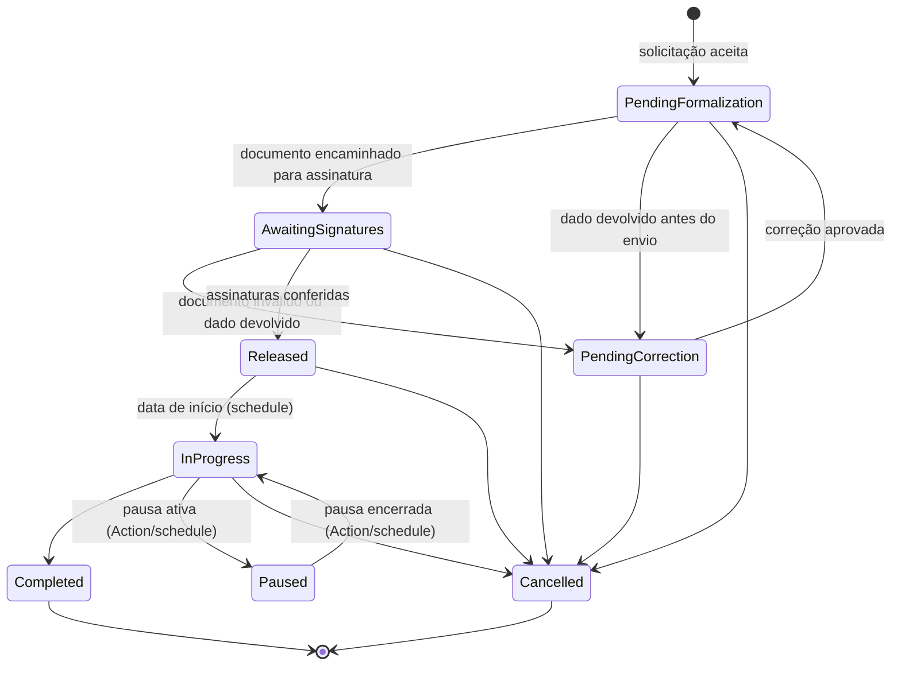

> [!todo] Estado
> Planejado. O enum existente deverá ser refatorado: os estados de formulário e análise pertencem a `InternshipRequestStatus`, não a `internships.status`.

## Contrato

| Case                 | Valor persistido      | Rótulo                    |
| -------------------- | --------------------- | ------------------------- |
| `PendingFormalization` | `pending_formalization` | Em formalização         |
| `AwaitingSignatures` | `awaiting_signatures` | Aguardando assinaturas    |
| `PendingCorrection`  | `pending_correction`  | Com pendência documental  |
| `Released`           | `released`            | Liberado                  |
| `InProgress`         | `in_progress`         | Em andamento              |
| `Paused`             | `paused`              | Pausado                   |
| `Completed`          | `completed`           | Concluído                 |
| `Cancelled`          | `cancelled`           | Cancelado                 |

Um estágio nasce quando a solicitação é aceita, inicialmente em `PendingFormalization`. Nesse estado, o Setor escolhe o template, gera o documento e o encaminha para assinatura. Só então o estágio passa a `AwaitingSignatures`. Rascunho, envio, análise, pendência e recusa pertencem exclusivamente a [[SGE - Enum - InternshipRequestStatus|`InternshipRequestStatus`]]. O status de cada assinatura pertence a [[SGE - Enum - GeneratedDocumentStatus|`GeneratedDocumentStatus`]], não a este enum.

## Transições iniciais

## Checklist de implementação

- [ ] Refatorar o enum string e rótulos no código.
- [ ] Implementar/atualizar `options()` e `values()`.
- [ ] Adicionar cast em `Internship`.
- [ ] Usar o enum na [[SGE - Migration - 15 - Internships|migration de internships]].
- [ ] Implementar guardas para transições permitidas.
- [ ] Usar a mesma guarda na Action manual e em [[SGE - Schedules|Schedules]], sem `update` direto de status.
- [ ] Testar formalização, reemissão após pendência, liberação, pausa, retomada, conclusão e cancelamento.
- [ ] Atualizar [[SGE - Fluxos principais]] se as transições forem alteradas.

## Referência funcional

- [[SGE - Ciclos de status|Ciclos de status]] — regra pública de transição e conclusão.
