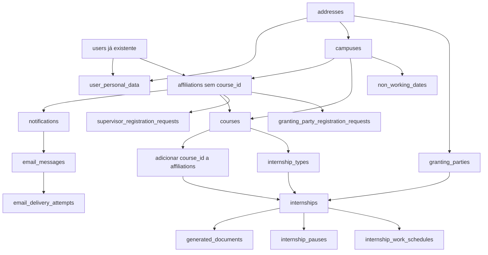

> [!abstract] Regra
> Cada migration deve ser pequena, revisável e testada em banco limpo. A nota individual registra o contrato; o arquivo PHP implementa o contrato.

## Estado da fundação atual

Estas migrations já existem no projeto novo e não devem ser recriadas. Cada uma tem uma nota com o contrato real, o rollback atual e as pendências de integração:

- [[SGE - Migration - Base 01 - Users|`users`, `password_reset_tokens` e `sessions`]] — autenticação;
- [[SGE - Migration - Base 02 - Cache|`cache` e `cache_locks`]] — cache e locks;
- [[SGE - Migration - Base 03 - Jobs|`jobs`, `job_batches` e `failed_jobs`]] — filas;
- [[SGE - Migration - Base 04 - Activity log|`activity_log`]] — auditoria;
- [[SGE - Migration - Base 05 - Media|`media`]] — arquivos polimórficos;

Não há migration de permissões: as tabelas anteriormente previstas foram removidas e a autorização usa Gates e Policies com os vínculos.

As migrations abaixo são o backlog do domínio e continuam pendentes até o código e os testes confirmarem cada contrato.

> [!info] Fonte dos contratos
> A implementação segue os contratos desta pasta e as decisões aprovadas no planejamento.

## Ordem de execução

| Ordem | Migration                                                | Tabela/alteração           | Dependências principais                                                                                    |
| ----: | -------------------------------------------------------- | -------------------------- | ---------------------------------------------------------------------------------------------------------- |
|    01 | [[SGE - Migration - 01 - Addresses]]                     | endereços atuais           | —                                                                                                          |
|    02 | [[SGE - Migration - 02 - User personal data]]            | dados pessoais             | `users`, `addresses`                                                                                       |
|    03 | [[SGE - Migration - 03 - Campuses]]                      | campi                      | `addresses`                                                                                                |
|    04 | [[SGE - Migration - 04 - Affiliations]]                  | vínculos base              | `users`, `campuses`, [[SGE - Enum - AffiliationType]]                                                      |
|    05 | [[SGE - Migration - 05 - Notifications]]                 | notificações internas      | `users`, `affiliations`                                                                                    |
|    06 | [[SGE - Migration - 06 - Email messages]]                | mensagens preparadas       | `notifications`, `users`, `affiliations`, [[SGE - Enum - EmailMessagePurpose]]                             |
|    07 | [[SGE - Migration - 07 - Email delivery attempts]]       | tentativas de transporte   | `email_messages`, [[SGE - Enum - EmailDeliveryAttemptStatus]]                                              |
|    08 | [[SGE - Migration - 08 - Email verification challenges]] | descartada                 | —                                                                                                            |
|    09 | [[SGE - Migration - 09 - Courses]]                       | cursos                     | `campuses`, `affiliations`                                                                                 |
|    10 | [[SGE - Migration - 10 - Affiliation course]]            | vínculo discente por curso | `courses`, `affiliations`                                                                                  |
|    11 | [[SGE - Migration - 11 - Internship types]]              | tipos e regras             | `courses`                                                                                                  |
|    12 | [[SGE - Migration - 12 - Granting parties]]              | partes concedentes         | `addresses`, [[SGE - Enum - PartyDocumentType]]                                                            |
|   12A | [[SGE - Migration - 12A - Supervisor registration requests]] | pedidos de supervisor | `affiliations`, [[SGE - Enum - RegistrationRequestStatus]] |
|   12B | [[SGE - Migration - 12B - Granting party registration requests]] | pedidos de concedente | `affiliations`, [[SGE - Enum - RegistrationRequestStatus]], [[SGE - Enum - PartyDocumentType]] |
|    13 | [[SGE - Migration - 13 - Document templates]]            | templates                  | —                                                                                                          |
|    14 | [[SGE - Migration - 14 - Template versions]]             | versões de templates       | `document_templates`                                                                                       |
|    15 | [[SGE - Migration - 15 - Internships]]                   | estágios e snapshots       | `users`, `addresses`, `courses`, `internship_types`, `granting_parties`, [[SGE - Enum - InternshipStatus]] |
|    16 | [[SGE - Migration - 16 - Generated documents]]           | documentos gerados         | `internships`, `template_versions`, enums documentais                                                      |
|    17 | [[SGE - Migration - 17 - Internship pauses]]             | pausas                     | `internships`                                                                                              |
|    18 | [[SGE - Migration - 18 - Evaluations]]                   | avaliações do supervisor   | `internships`, `affiliations`, [[SGE - Enum - EvaluationStatus]]                                           |
|    19 | [[SGE - Migration - 19 - Internship requests]]           | solicitações de estágio    | `affiliations`, `courses`, `internship_types`, `granting_parties`, `internships`, [[SGE - Enum - InternshipRequestStatus]] |
|   19A | [[SGE - Migration - 19A - Emancipation evidences]]        | provas de emancipação      | `internship_requests`, `media`, [[SGE - Enum - EmancipationEvidenceStatus]] |
|    20 | [[SGE - Migration - 20 - Internship request corrections]] | correções de solicitações | `internship_requests`, `affiliations`, [[SGE - Enum - InternshipRequestCorrectionStatus]]                  |
|    21 | [[SGE - Migration - 21 - Internship cancellation requests]] | pedidos de cancelamento | `internships`, `affiliations`, [[SGE - Enum - InternshipCancellationRequestStatus]] |
|    22 | [[SGE - Migration - 22 - Non-working dates]]              | calendário sem expediente | `campuses`, `affiliations`, [[SGE - Enum - NonWorkingDateScope]] |
|    23 | [[SGE - Migration - 23 - Internship work schedules]]      | jornada e aditivos         | `internships`, `generated_documents`, `affiliations` |

## Dependências críticas

> [!warning] Não inverter 04, 09 e 10
> `affiliations` precisa existir para que `courses` possa referenciar os coordenadores. `courses` precisa existir antes de adicionar `course_id` aos vínculos. Essa é a razão da separação da ordem.

## Checklist comum

Cada nota individual deve terminar com todos estes pontos marcados:

- [ ] contrato revisado contra [[SGE - Domínio e modelo de dados]];
- [ ] FKs, índices, nulabilidade e unicidade definidos;
- [ ] `cascade`, `restrict` ou `nullOnDelete` escolhidos conscientemente;
- [ ] migration criada e nomeada conforme a tabela/alteração;
- [ ] Model, relações, casts de enum e casts de JSONB atualizados;
- [ ] factory/seed mínima criada quando aplicável;
- [ ] `migrate` executado em banco limpo;
- [ ] `migrate:rollback` testado quando a reversão for segura;
- [ ] testes de restrições e casos inválidos criados;
- [ ] [[SGE - Guia de desenvolvimento|fase]] e modelo de dados atualizados.

## Navegação

- [[SGE - Enums|Índice de enums]]
- [[SGE - Guia de desenvolvimento]]
- [[SGE - Domínio e modelo de dados]]
- [[SGE - Enums e migrations|Portal antigo de enums e migrations]]
