> [!abstract] Propósito
> Este é o painel de execução do novo SGE. Ele mostra a ordem do trabalho e aponta para as notas onde cada tarefa é detalhada. A regra é simples: o painel orienta; as notas de fase e de referência registram a execução.

> [!tip] Próximo passo
> Abra a primeira fase com item pendente, entre nas notas vinculadas e marque a tarefa somente depois de implementar, testar e documentar o comportamento.

> [!note] Convenções
> Consulte [[SGE - Convenções da documentação]] para saber qual nota é fonte de verdade, como registrar estado e como apontar para o código. O painel em [[SGE - Painel de desenvolvimento.base]] permite acompanhar fases, enums, migrations e componentes no Obsidian.

## Painel de execução

Marque uma fase como concluída apenas quando todos os itens da nota correspondente estiverem concluídos.

- [x] [[SGE - Fase 00 - Preparação|Fase 00 — Preparação]] — ambiente, qualidade e fluxo de trabalho.
- [ ] [[SGE - Fase 01 - Contratos de e-mail|Fase 01 — Contratos de e-mail e notificações]] — base transversal antes da autenticação.
- [ ] [[SGE - Fase 03 - Fundação de dados|Fase 03 — Fundação de dados]] — enums, migrations, modelos e dados cadastrais.
- [ ] [[SGE - Fase 04 - Conta e contexto|Fase 04 — Conta, autenticação e contexto]] — login e seleção de vínculo.
- [ ] [[SGE - Fase 05 - Administração|Fase 05 — Administração e catálogos]] — policies, perfis, campi, cursos e tipos.
- [ ] [[SGE - Fase 06 - Documentos|Fase 06 — Templates e documentos]] — versões, geração e assinatura externa.
- [ ] [[SGE - Fase 07 - Abertura do estágio|Fase 07 — Abertura e análise do estágio]].
- [ ] [[SGE - Fase 08 - Estágio em andamento|Fase 08 — Estágio em andamento]].
- [ ] [[SGE - Fase 09 - Avaliação e conclusão|Fase 09 — Avaliação e conclusão]].
- [ ] [[SGE - Fase 10 - Serviços transversais|Fase 10 — Serviços transversais]].

## Ordem e dependências

```mermaid
flowchart LR
    A[00 Preparação] --> B[01 E-mails e notificações]
    B --> D[03 Fundação de dados]
    D --> E[04 Conta e contexto]
    E --> F[05 Administração]
    F --> G[06 Documentos]
    G --> H[07 Abertura]
    H --> I[08 Em andamento]
    I --> J[09 Avaliação]
    J --> K[10 Transversais]
```

As dependências não impedem trabalho preparatório em paralelo, mas impedem marcar uma fase como pronta sem a anterior estar definida. Dúvidas de negócio devem ser registradas em [[SGE - Backlog e decisões]] antes de alterar código ou marcar uma tarefa.

## Como trabalhar em cada tarefa

1. Abra a nota da fase e escolha o primeiro item não concluído.
2. Siga os links para a nota do [[SGE - Enums|enum]], [[SGE - Migrations|migration]] ou regra de domínio relacionada.
3. Use [[SGE - Desenvolvimento - Checklist de funcionalidade|Checklist de funcionalidade]] para não esquecer autorização, testes, filas e documentação.
4. Atualize o checkbox na nota mais específica. Depois atualize o resumo da fase e este painel.
5. Se a implementação revelar uma nova regra, registre a decisão em [[SGE - Backlog e decisões]] e atualize as notas afetadas.

## Referências de implementação

### Enums

Cada enum tem uma nota própria com casos, valores persistidos, rótulos e checklist de código/testes.

- [[SGE - Enums|Índice de enums]]
- [[SGE - Enum - AffiliationType|AffiliationType]]
- [[SGE - Enum - EmailMessagePurpose|EmailMessagePurpose]]
- [[SGE - Enum - EmailDeliveryAttemptStatus|EmailDeliveryAttemptStatus]]
- [[SGE - Enum - InternshipRequestStatus|InternshipRequestStatus]]
- [[SGE - Enum - InternshipRequestCorrectionStatus|InternshipRequestCorrectionStatus]]
- [[SGE - Enum - InternshipStatus|InternshipStatus]]
- [[SGE - Enum - PartyDocumentType|PartyDocumentType]]
- [[SGE - Enum - GeneratedDocumentType|GeneratedDocumentType]]
- [[SGE - Enum - GeneratedDocumentStatus|GeneratedDocumentStatus]]
- [[SGE - Enum - GeneratedDocumentOrigin|GeneratedDocumentOrigin]]
- [[SGE - Enum - EvaluationStatus|EvaluationStatus]]
- [[SGE - Enum - RegistrationRequestStatus|RegistrationRequestStatus]]
- [[SGE - Enum - InternshipCancellationRequestStatus|InternshipCancellationRequestStatus]]
- [[SGE - Enum - EmancipationEvidenceStatus|EmancipationEvidenceStatus]]
- [[SGE - Enum - NonWorkingDateScope|NonWorkingDateScope]]

### Migrations

Cada migration tem uma nota própria com dependências, campos, FKs, índices, comportamento de exclusão e checklist de validação.

- [[SGE - Migrations|Índice de migrations]]
- [[SGE - Migration - 01 - Addresses|01 — addresses]]
- [[SGE - Migration - 02 - User personal data|02 — user_personal_data]]
- [[SGE - Migration - 03 - Campuses|03 — campuses]]
- [[SGE - Migration - 04 - Affiliations|04 — affiliations]]
- [[SGE - Migration - 05 - Notifications|05 — notifications]]
- [[SGE - Migration - 06 - Email messages|06 — email_messages]]
- [[SGE - Migration - 07 - Email delivery attempts|07 — email_delivery_attempts]]
- [[SGE - Migration - 09 - Courses|09 — courses]]
- [[SGE - Migration - 10 - Affiliation course|10 — course_id em affiliations]]
- [[SGE - Migration - 11 - Internship types|11 — internship_types]]
- [[SGE - Migration - 12 - Granting parties|12 — granting_parties]]
- [[SGE - Migration - 12A - Supervisor registration requests|12A — supervisor_registration_requests]]
- [[SGE - Migration - 12B - Granting party registration requests|12B — granting_party_registration_requests]]
- [[SGE - Migration - 13 - Document templates|13 — document_templates]]
- [[SGE - Migration - 14 - Template versions|14 — template_versions]]
- [[SGE - Migration - 15 - Internships|15 — internships]]
- [[SGE - Migration - 16 - Generated documents|16 — generated_documents]]
- [[SGE - Migration - 17 - Internship pauses|17 — internship_pauses]]
- [[SGE - Migration - 18 - Evaluations|18 — avaliações do supervisor]]
- [[SGE - Migration - 19 - Internship requests|19 — internship_requests]]
- [[SGE - Migration - 19A - Emancipation evidences|19A — emancipation_evidences]]
- [[SGE - Migration - 20 - Internship request corrections|20 — correções]]
- [[SGE - Migration - 21 - Internship cancellation requests|21 — cancelamentos]]
- [[SGE - Migration - 22 - Non-working dates|22 — non_working_dates]]
- [[SGE - Migration - 23 - Internship work schedules|23 — internship_work_schedules]]

### Componentes técnicos

O inventário do código transversal também está separado por responsabilidade:

- [[SGE - Componentes técnicos|Índice de componentes técnicos]]
- [[SGE - Casts|Casts]]
- [[SGE - Helpers|Helpers]]
- [[SGE - Concerns|Concerns]]
- [[SGE - Actions|Actions]]
- [[SGE - Services|Services]]
- [[SGE - Providers|Providers]]
- [[SGE - Model - User|Model User]]
- [[SGE - Testes existentes|Testes existentes e lacunas]]
- [[SGE - Configuração e bootstrap|Configuração e bootstrap]]

## Referências de governança

- [[SGE - Planejamento|Índice de planejamento]]
- [[SGE - Matriz de autorização|Matriz de autorização]]
- [[SGE - Convenções da documentação|Convenções da documentação]]

> [!info] Por que `course_id` fica separado?
> `courses` precisa apontar para os vínculos dos coordenadores, enquanto o vínculo de discente precisa apontar para `courses`. Criar `affiliations` sem `course_id`, criar `courses`, e só então adicionar `course_id` resolve o ciclo de FKs sem usar uma migration impossível de executar em banco limpo.

## Definição de pronto

Uma funcionalidade ou migration pode ser marcada como concluída quando:

- [ ] a regra está descrita e tem fonte canônica no planejamento;
- [ ] decisões pendentes foram resolvidas em [[SGE - Backlog e decisões]];
- [ ] entidades, estados, FKs, índices e snapshots estão definidos;
- [ ] migration/modelo, casts e relacionamentos foram implementados;
- [ ] autorização e escopo por vínculo/campus foram testados;
- [ ] validações, caminhos de erro e transições foram testados;
- [ ] Activity Log, notificações e Jobs foram avaliados;
- [ ] testes unitários/feature/autorização passam;
- [ ] `./vendor/bin/sail composer run test` passa;
- [ ] diagramas e documentação foram atualizados;
- [ ] a mudança está pronta para revisão em um commit objetivo.

## Contexto do projeto

- [[SGE - Arquitetura atual]] — decisões técnicas.
- [[SGE - Domínio e modelo de dados]] — entidades e regras de dados.
- [[SGE - Fluxos principais]] — fluxos funcionais.
- [[SGE - Ambiente de desenvolvimento]] — comandos e serviços locais.
- [[SGE - E-mails, notificações e entregas]] — contrato de mensagens e entregas.
- [[SGE - Geração de documentos DOCX e variáveis]] — motor DOCX e catálogo canônico.
