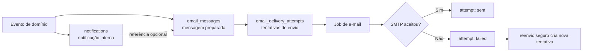
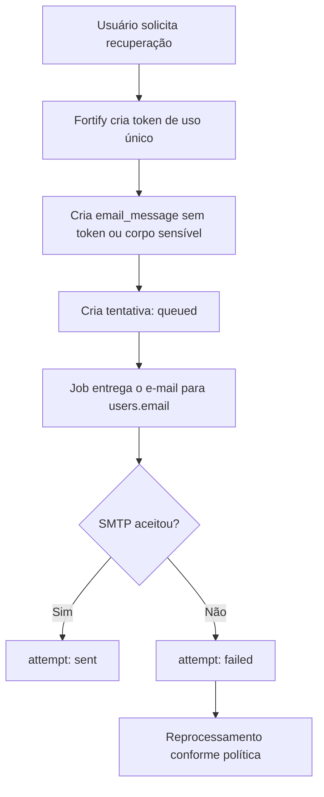
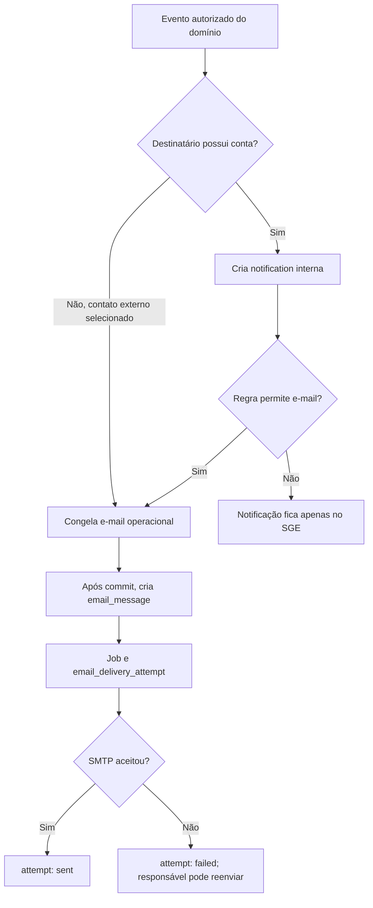

> [!abstract] Decisão de planejamento
> Esta é a primeira fundação transversal a ser detalhada antes das demais funcionalidades. Ela define como preservar notificações, conteúdo de e-mails e tentativas de entrega. Não descreve código já implementado.

## Objetivo e limites

O SGE terá uma trilha separada para a notificação exibida no sistema, a mensagem de e-mail gerada e as tentativas de enviá-la. Assim, reenvios e falhas não sobrescrevem o histórico nem fazem uma notificação parecer enviada quando o provedor recusou a mensagem.

O termo **enviado** neste plano significa que o provedor SMTP aceitou a mensagem. Confirmação de abertura ou leitura do e-mail não faz parte do escopo inicial. A leitura da notificação interna continua independente, controlada exclusivamente por `read_at`.

## Estruturas planejadas

### `notifications`

Usará a convenção da tabela nativa plural do Laravel. Cada linha representa uma notificação destinada a uma pessoa dentro do sistema; para avisos de domínio, também preserva o vínculo que determinou o contexto e o destinatário.

| Campo                               | Tipo conceitual    | Finalidade                                                                 |
| ----------------------------------- | ------------------ | -------------------------------------------------------------------------- |
| `id`                                | uuid               | Identificador compatível com Notifications do Laravel.                     |
| `notifiable_type` / `notifiable_id` | morph              | Destinatário interno; inicialmente `User`.                                 |
| `affiliation_id`                    | bigint nullable    | Vínculo que define o contexto e o e-mail operacional, quando houver.       |
| `type`                              | string             | Classe/tipo estável da notificação.                                        |
| `data`                              | jsonb              | Título, texto interno, rota/entidade de destino e metadados não sensíveis. |
| `deduplication_key`                 | string nullable    | Chave estável e única de evento/destinatário, usada nos avisos idempotentes. |
| `read_at`                           | timestamp nullable | Leitura no SGE; não representa leitura do e-mail.                          |
| `created_at` / `updated_at`         | timestamp          | Auditoria temporal.                                                        |

Notificações de estágio, vínculo, avaliação e demais eventos operacionais devem nascer aqui antes de serem encaminhadas ao e-mail. A notificação destinada apenas ao Setor de Estágio permanece interna. Para eventos reexecutáveis, como schedules, `deduplication_key` combina fato, entidade, data efetiva e destinatário; a mesma chave recupera o aviso já existente em vez de criar outra linha.

O aviso de documento disponível para assinatura é uma exceção controlada por seleção humana: ao mover o documento para `awaiting_signature`, o Setor escolhe os interessados elegíveis. Para cada selecionado com conta, cria-se `notification` interna e `email_message`; para o contato externo da concedente, quando selecionado e sem conta, cria-se somente `email_message`, com `notification_id`, `user_id` e `affiliation_id` nulos. Não há caixa de texto para destinatário livre. O conteúdo usa o local de disponibilização informado pelo Setor e não pressupõe uma plataforma específica.

### `email_messages`

Representa uma mensagem preparada, com destinatário e conteúdo congelados no instante da geração. É a fonte de consulta do que seria enviado; não é uma tentativa de transporte.

| Campo                               | Tipo conceitual | Finalidade                                                                         |
| ----------------------------------- | --------------- | ---------------------------------------------------------------------------------- |
| `id`                                | uuid            | Identificador da mensagem.                                                         |
| `notification_id`                   | uuid nullable   | FK para `notifications` quando o e-mail deriva de um aviso interno.                |
| `user_id`                           | bigint nullable | Conta relacionada; obrigatório para e-mails de autenticação.                       |
| `affiliation_id`                    | bigint nullable | Vínculo usado para resolver o destinatário operacional.                            |
| `purpose`                           | enum            | Finalidade estável, como `password_reset`, `notification` ou `new_affiliation`. |
| `recipient_email`                   | string          | Snapshot do endereço efetivamente escolhido.                                       |
| `subject`                           | string nullable | Assunto final, quando não expuser segredo.                                         |
| `content_text` / `content_html`     | text nullable   | Snapshot do conteúdo renderizado, nos casos permitidos.                            |
| `template_key` / `template_version` | string nullable | Identificação do template utilizado.                                               |
| `idempotency_key`                   | uuid unique     | Evita que a mesma solicitação gere mensagens duplicadas.                           |
| `created_at` / `updated_at`         | timestamp       | Rastreabilidade.                                                                   |

Para e-mails de notificação, `content_text` e `content_html` devem guardar o conteúdo final renderizado. Eles, o endereço e os metadados deverão receber proteção compatível com dados pessoais (por exemplo, cast criptografado no modelo e autorização restrita de consulta). Uma alteração posterior de template, usuário ou vínculo não poderá alterar esse snapshot.

### `email_delivery_attempts`

Cada registro representa uma tentativa real de envio de uma `email_message`; reprocessar ou reenviar cria outra linha. O conteúdo não é duplicado aqui.

| Campo                                 | Tipo conceitual    | Finalidade                                                   |
| ------------------------------------- | ------------------ | ------------------------------------------------------------ |
| `id`                                  | uuid               | Identificador da tentativa.                                  |
| `email_message_id`                    | uuid               | FK para a mensagem.                                          |
| `attempt_number`                      | smallint           | Sequência por mensagem.                                      |
| `status`                              | enum               | `queued`, `sent` ou `failed`.                                |
| `provider`                            | string nullable    | Provedor/transport utilizado, inicialmente SMTP configurado. |
| `provider_message_id`                 | string nullable    | Identificador retornado pelo provedor, se disponível.        |
| `queued_at` / `sent_at` / `failed_at` | timestamp nullable | Marcos temporais do processamento.                           |
| `failure_reason`                      | text nullable      | Erro técnico sanitizado; nunca credenciais ou tokens.        |
| `created_at` / `updated_at`           | timestamp          | Auditoria temporal.                                          |

O Job cria ou reserva a tentativa antes de chamar o transportador. Só define `sent_at` e `status = sent` depois da aceitação pelo SMTP; exceções, recusas e esgotamento de tentativas ficam como `failed` e podem originar um reenvio autorizado. Não existe o status intermediário `sending`. O `idempotency_key` e uma restrição única em (`email_message_id`, `attempt_number`) impedem duplicidade acidental.

## Regras por finalidade

| Finalidade                     | Destinatário                                    | Registros obrigatórios                                         | Conteúdo persistido                                                                                                    |
| ------------------------------ | ----------------------------------------------- | -------------------------------------------------------------- | ---------------------------------------------------------------------------------------------------------------------- |
| Recuperação de senha           | `users.email`                                   | `email_messages` e ao menos uma `email_delivery_attempt`       | Não guardar URL, token nem corpo que os contenha. Registrar finalidade, destinatário, template e resultado da entrega. |
| Notificação operacional a usuário | `affiliations.email`, conforme o vínculo     | `notifications`, `email_messages` e tentativas                 | Guardar assunto e versões texto/HTML renderizadas, protegidas e imutáveis.                                             |
| Aviso externo de assinatura    | e-mail cadastrado da concedente, quando selecionado | `email_messages` e tentativas; sem notificação interna      | Guardar o local informado, documento e conteúdo renderizado; não criar destinatário livre.                            |
| Resumo do Setor de Estágio     | somente notificação interna do vínculo do Setor | `notifications`; sem `email_messages`                          | Guardar contagens e links filtrados do resumo diário, sem listar dados sensíveis.                                      |
| Aviso de novo vínculo          | E-mail do vínculo definido pela regra do evento | `notifications`, `email_messages` e tentativas                 | Mesmo padrão de notificação operacional.                                                                               |

> [!warning] Segredos não entram no log
> Tokens de redefinição, URLs assinadas, senhas e credenciais SMTP nunca podem ser registrados em conteúdo, `data`, exceções ou Activity Log. O requisito de preservar conteúdo aplica-se às notificações operacionais; mensagens de autenticação registram somente conteúdo/metadados seguros e a prova da entrega. O SGE não terá código nem fluxo de verificação de e-mail.

## Fluxos planejados

### Recuperação de senha

### Notificação operacional por e-mail

## Ordem de implementação futura

O planejamento acima deve ser mantido antes das demais funcionalidades. A implementação física, porém, só poderá criar as FKs depois de `users` e `affiliations`.

1. Criar os enums de finalidade e status.
2. Criar as três migrations e seus índices/FKs.
3. Implementar Models, casts protegidos, relações e factories.
4. Integrar o envio de recuperação do Fortify ao log seguro.
5. Definir o fluxo seguro de senha inicial sem verificação de e-mail.
6. Criar a base comum que grava `notifications`, mensagens e tentativas para eventos de domínio.
7. Configurar Jobs, limite de taxa, reprocessamento, alertas de falha e autorização de reenvio.
8. Cobrir fluxos, idempotência, reenvio e proteção de segredos com testes.

## Pendência de retenção

A duração de retenção de `email_messages`, tentativas e conteúdo precisa seguir a política institucional de auditoria e LGPD. Até essa decisão, o acesso deve ser mínimo, auditado e permitido apenas a perfis administrativos autorizados; limpeza automática não deve ser implementada sem a definição formal de prazo.

Veja também [[SGE - Enums]], [[SGE - Migrations]], [[SGE - Guia de desenvolvimento]], [[SGE - Domínio e modelo de dados]] e [[SGE - Fluxos principais]].
